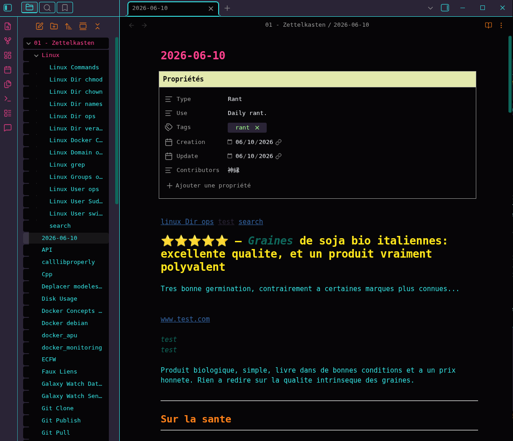

# Tokyo Terminal

```shin'en
   /$$            /$$            /$$     /$$$$$$$$$$      
  | $$/$$    /$$$$$$$$$$$$      /$$  /$$ |_______/$$      
   \/ $$    | $$__ $$__ $$     /$$  /$$      /$$/$$$      
   / $$     | $$  \$$  \$$    /$$$$$$$ /$$$$$$$$$$$$$$$   
  / $$ $$   | $$$$$$$$$$$$   |___/$$$  |___/$$$$\____ /   
/ $$ $$ \$$ | $$__ $$__ $$      /$$/ /$$   |__\$$$ /$$/   
|__/ $$ |_/ | $$$$$$$$$$$$    /$$$$$$$$$$ \$$$_$$$\$$/    
   | $$     | $$_| $$__ $$   /$$______/ \$|___/$$/$$$\    
   | $$     |__/ | $$  |_/   |/$$ |$$ \$$//$$$$$$|$$$\    
   | $$          | $$        /$$/ |$$  \$$\_/$$$/ |$$$_   
   |__/          |__/        |_/  |_/   \/|$$$$/   \$$$   
```

-----------------------------------------
## Description
-----------------------------------------

---
### Short Description (for marketplace/extension metadata)

```plaintext
Tokyo Terminal is a neon, high-contrast Obsidian theme inspired by a retrofuturist 80s terminal aesthetics, and Tokyo electric nights. Built for clarity and vibrancy, with maximum visual efficiency.
```

---
### Long README Introduction

**Welcome to *tokyo-terminal***, an Obsidian theme that transports your editor to a neon-colored terminal circa 1984.
This isn’t just a color scheme; it’s a high-contrast, high-energy workspace for developers who crave **clarity and visual accentuation**.

Transform Obsidian into a neon-lit, retro-futurist terminal with high-contrast colors and synthwave accents inspired by Tokyo electric nights aesthetics.

Apply crisp cyan on deep purple and near-black backgrounds, with hot pink, sunset orange, gold and deep violet highlights for syntax and UI.

#### Design Philosophy

Inspired by the **hypnotic color glow of vintage CRTs**, the **hyper-saturated dreams of synthwave**, *vibrancy of outrun nostalgia*, tokyo-terminal is a love letter to the 80s as I reimagined, restylized and modernized them.
Think of **synths, oversaturated consoles**, a world of outrun sunsets and cyber alleyways, just free of VHS static. With a nod to Taki Ono’s neon design photography, this theme merges retro-futurism with modern clarity.

Here for VSCodium, *tokyo-terminal* delivers:
- **Bold readability**: Crisp **cyan (#34e2e2)** syntax on deep **purple (#2a2436)** and **near-black (#060507)** backgrounds.
- **Electric accents**: **Hot pink (#FF418E)**, **sunset orange (#FE8019)**, **gold (#FFE61C)**, and **deep violet (#6C18D6)** for keywords, functions, and UI highlights.
- **Retro-futuristic contrast**: Designed to reduce eye strain while keeping your code *visually alive*—like hacking a mainframe in a cybercafé circa 1984.
- **Minimalist efficiency** grit meets glamour.

For developers/writers nostalgic of the future. For those who code like the future depends on it (Because it does).

-----------------------------------------
## Palette
-----------------------------------------

| Color           | Hex       | Usage                    |
|---              |---        |---                       |
| Black           | `#060507` | Darkest Background       |
| Magenta         | `#2a2436` | Lighter Background       |
| BrightCyan      | `#34e2e2` | Main text                |
| Cyan            | `#0f675b` |                          |
| Red             | `#ff418e` | Accents                  |
| BrightYellow    | `#ffe61c` |                          |
| Yellow          | `#fe8019` |                          |
| BrightMagenta   | `#6c18d6` | Activity accent          |
| BrightGreen     | `#A3FF8C` | Strings                  |
| Green           | `#7fff00` | Comments                 |
| BrightRed       | `#FF3B3B` | Errors and Bool = false  |
| Blue            | `#3465a4` | Links                    |
| BrightBlue      | `#181efd` | Rarely used super accent |
| BrightWhite     | `#ECEFF4` | Plaintext                |
| BrightBlack     | `#999988` |                          |
| White           | `#ACEEEE` |                          |
| +oldRed         | `#d66666` |                          |
| +Pink           | `#F1ADFF` |                          |
| +Gold           | `#E3E9AE` |                          |

-----------------------------------------
## ToDo
-----------------------------------------

- [x] Publishing Obsidian version
- [x] Publishing VS Codium version on the marketplace
- [ ] Publishing VS Code version on the marketplace
- [ ] Find KaTeX devs and ask them to add an align tag resetter
- [ ] Publish Licence to SPDX
- [ ] Review port to Firefox
- [ ] Port to Chrome
- [ ] Internal link hovering should be purple or blue and without underline. Both types hover in cyan for now and I could not figure out how to overcome that behavior.
<br><br>

> Do not hesitate to drop me a line on GitHub if you spot an issue, see more tweaks and like the color scheme.

-----------------------------------------
## Screenshots
-----------------------------------------




---
**Made by 神縁 in 2026 under MIT License**
[GitHub](https://github.com/TSLST)
[Mastodon](https://mastodon.social/@TSLST) Even though I don't actually like Mastodon